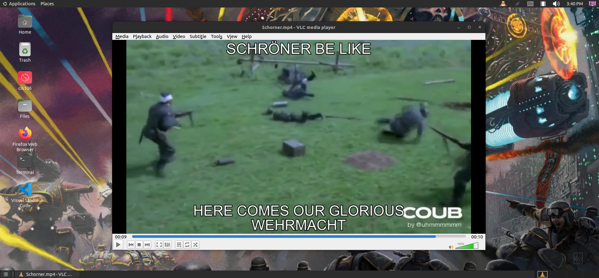

# Lab 3

## Desktop Personalization

### GNOME CLASSIC Desktop - Warhammer 40k Chaos Titans in the Siege of Terra

### Tilix - Titanfall 2 MRVN Emotes Callsign

## Application Installation

| Purpose | Package Name | Version |
|-------------|-------------|-------------|
| Playing Tetris | TINT | 0.07 |
| Playing a Video | VLC | 3.0.16-1build7 |
| Internet Browsing | Firefox | 1:1snap1-0ubuntu2 |
| Mail | Gmail GUI | 1.0.0 |
| Music | Spotify | 1.1.84.716.gc5f8b819 |

### Tetris - TINT

Sucks that the game closes upon losing. 

### Video Player - VLC Media Player

No context needed

### Internet Browser - Firefox

### Mail - GmailGUI

### Music - Spotify

Apologies for the ads, I haven't installed a modified client from Github that removes Spotify ads yet. 

## Simple Commands

| Command | Purpose |
|--------------------------|--------------------------|
| echo | Writes user input as output ie. echo Hello will output Hello|
| fortune | Outputs epigrams / fortunes based on user given parameters, otherwise it will choose at random if no input is given |
| cowsay | Generates an ASCII art of a textbox containing user input being said by a cow | 
| lolcat | Links user input to the output and applies a rainbow color filter, output can be modified with parameters |
| figlet | Creates ASCII art lettering out of user input |
| toilet | Similar to figlet, but is supports more features such as unicode handling, and colored fonts | 
| rig | Pieces together random first names, last names, street number, address, geographically consistent city, state, ZIP, and area code (Very useful for signing for dumb sites) |
