# Lab 4: Linux File System

## Question 1: Navigation

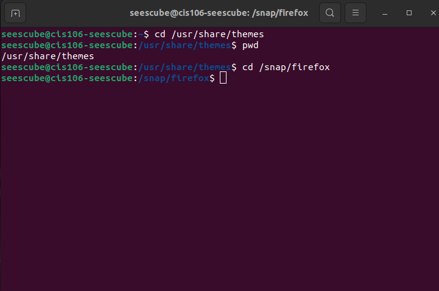
Absolute path with cd and pwd commands.

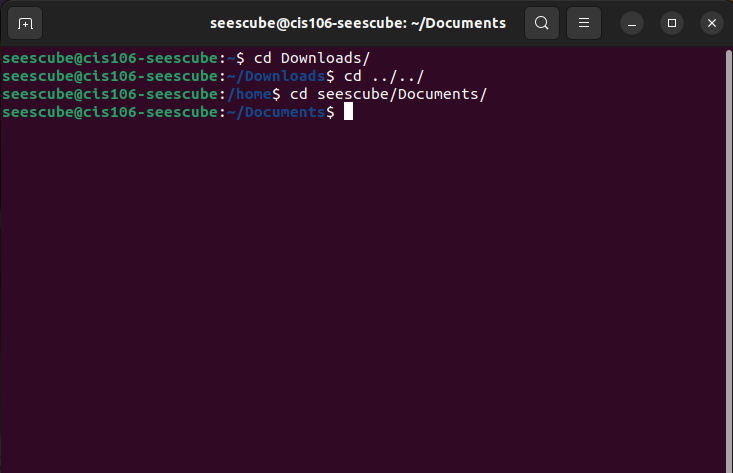
Relative path with cd and pwd commands.

## Question 2: ls Command

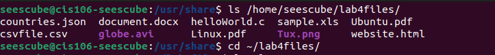
Listing files through absolute path.

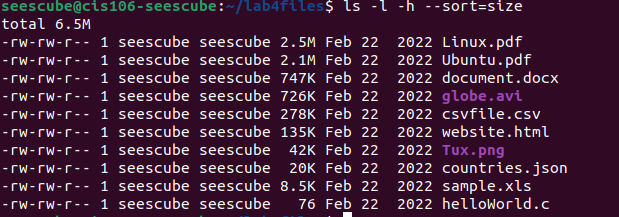
Long list sorted by size.

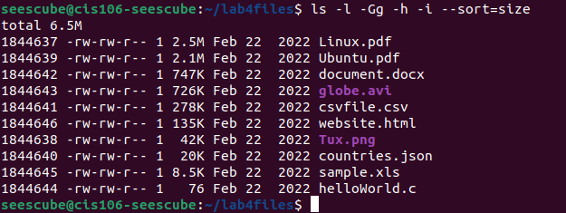
Long list sorted by size, users and groups omitted, inode number displayed.

## Question 3: Tree and Exa

### Tree Exercises

### Exa Exercises

## Question 4: Challenge 1

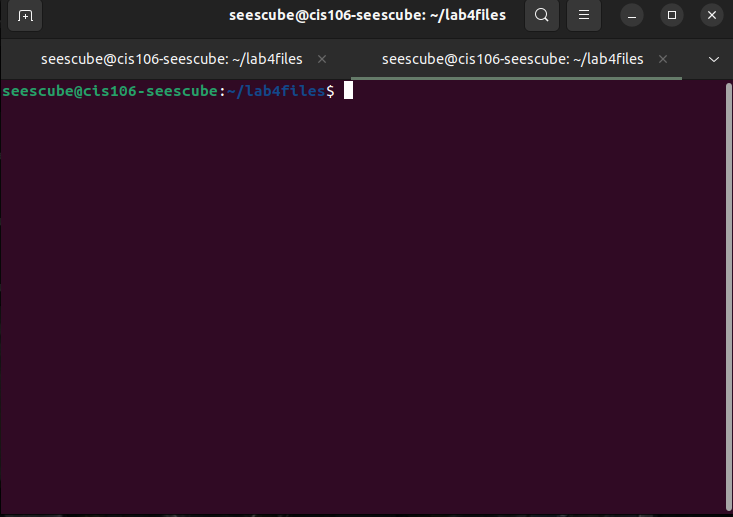
Started a new terminal after doing Q2. Current location is still in lab4files.

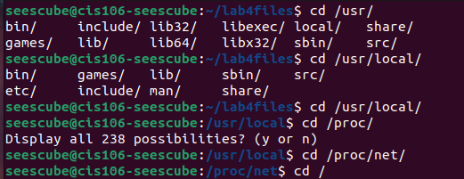
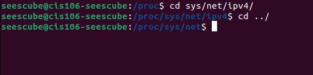

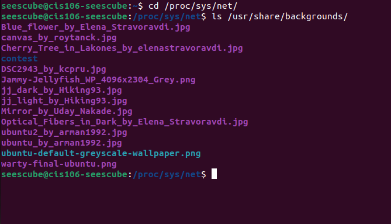
Listing files located in a different directory.

List of files in the Cis-106 folder.

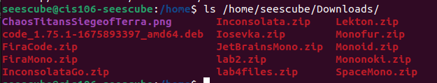
List of files in Downloads.

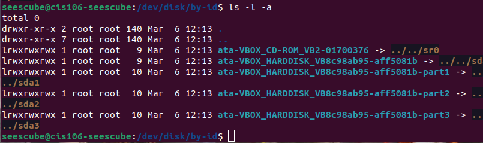

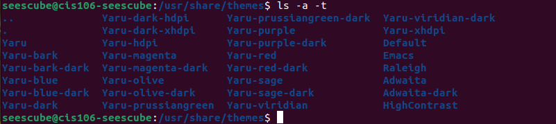
Listing themes sorted by time.

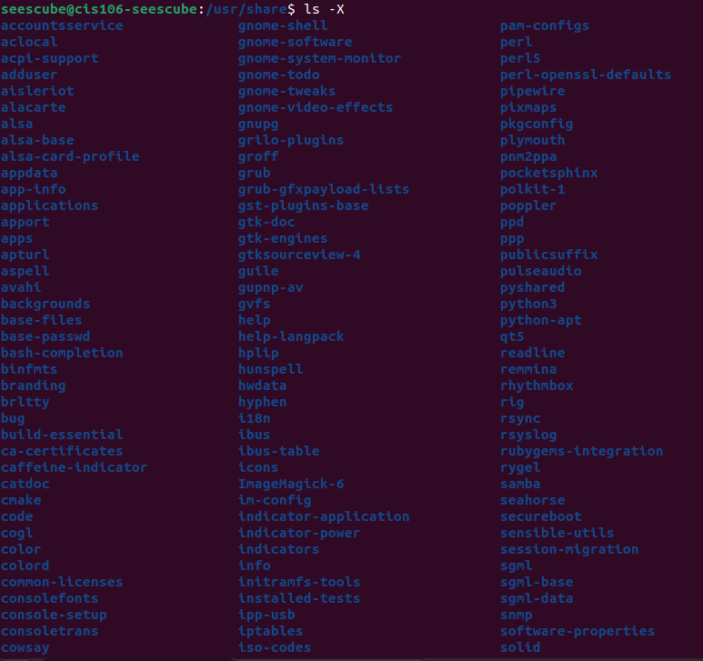
List of everything in the usr/share directory sorted by extension. This is only a portion of the files shown. 

## Question 5: Challenge 2

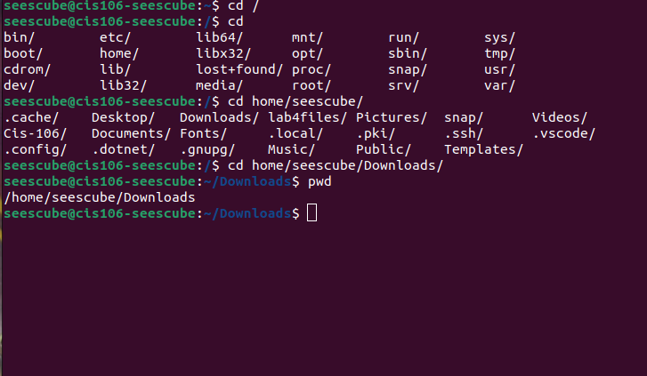
From root to the Downloads folder, one directory at a time.

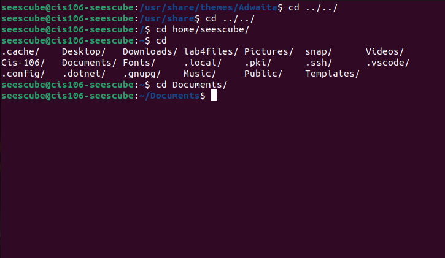
Navigating between directories.
